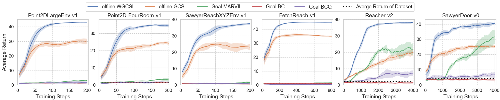

# Weighted Goal-conditioned Supervised Learning (WGCSL)
WGCSL is a simple but effective algorithm for both online and offline multi-goal Reinforcement Learning via weighted supervised learning. 

We provide offline multi-goal dataset in the 'offline_data' folder, including 'random' and 'expert' settings. The 'buffer.pkl' is used for WGCSL and GCSL, and each item in the buffer are also provided as *.npy files.

<div style="text-align: center;">

</div>


## Requirements
python3.6+, tensorflow, gym, mujoco, mpi4py

## Installation
- Clone the repo and cd into it:

- Install baselines package
    ```bash
    pip install -e .
    ```


## Usage
Environments: Point2DLargeEnv-v1, Point2D-FourRoom-v1, FetchReach-v1, SawyerReachXYZEnv-v1, Reacher-v2, SawyerDoor-v0.

WGCSL: 
```bash
python3 -m  wgcsl.run  --env=FetchReach-v1 --num_env 1 --mode supervised --log_path ~/${path_name} --su_method gamma_exp_adv_clip10 
```

GCSL:
```bash
python -m  wgcsl.run  --env=Point2DLargeEnv-v1  --num_env 1 --mode supervised
```

GCSL + Discount Relabeling Weight:
```bash
python -m  wgcsl.run  --env=Point2DLargeEnv-v1  --num_env 1 --mode supervised --su_method gamma
```

GCSL + Goal-conditioned Exponential Advantage Weight:
```bash
python -m  wgcsl.run  --env=Point2DLargeEnv-v1  --num_env 1 --mode supervised --su_method exp_adv
```

Offline WGCSL
```bash
python3 -m  wgcsl.run  --env=FetchReach-v1 --num_env 1 --mode supervised  --random_init 0 --load_path ./offline_data/random/FetchReach-v1/ --load_buffer --su_method gamma_exp_adv_clip10
```

Offline GCSL
```bash
python3 -m  wgcsl.run  --env=FetchReach-v1 --num_env 1 --mode supervised  --random_init 0 --load_path ./offline_data/random/FetchReach-v1/ --load_buffer
```

Goal MARVIL
```bash
python3 -m  wgcsl.run  --env=FetchReach-v1 --num_env 1 --mode supervised  --random_init 0 --load_path ./offline_data/random/FetchReach-v1/ --load_buffer  --su_method exp_adv  --no_relabel True 
```

Goal Behavior Cloning
```bash
python3 -m  wgcsl.run  --env=FetchReach-v1 --num_env 1 --mode supervised  --random_init 0 --load_path ./offline_data/random/FetchReach-v1/ --load_buffer   --no_relabel True 
```