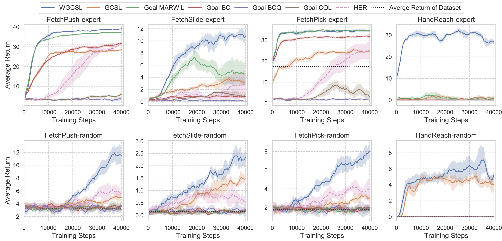

# Weighted Goal-conditioned Supervised Learning (WGCSL)
Code for ICLR 2022 paper [*Rethinking Goal-Conditioned Supervised Learning and Its Connection to Offline RL*](https://openreview.net/forum?id=KJztlfGPdwW) ([website](https://sites.google.com/view/wgcsl/)).
WGCSL is a simple but effective algorithm for offline goal-conditioned Reinforcement Learning via weighted supervised learning. 

We provide offline goal-conditioned benchmark with offline dataset in the 'offline_data' folder, including 'random' and 'expert' settings. The 'buffer.pkl' is used for WGCSL and other algorithms included in our codes (GCSL, MARVIL, BC, HER, DDPG, Actionable Models), and each item in the buffer are also provided as *.npy files for training Goal BCQ and Goal CQL. Due to the storage limitation, the full offline dataset is in this anonymous google drive link: https://drive.google.com/drive/folders/1SIo3qFmMndz2DAnUpnCozP8CpG420ANb.


<div style="text-align: center;">

</div>


## Requirements
python3.6+, tensorflow, gym, mujoco, mpi4py

## Installation
- Clone the repo and cd into it

- Install baselines package
    ```bash
    pip install -e .
    ```


## Usage
Environments: PointReach, PointRooms, Reacher, SawyerReach, SawyerDoor,FetchReach, FetchSlide, FetchPick, HandReach.

WGCSL: 
```bash
python -m  wgcsl.run  --env=FetchReach --num_env 1 --mode supervised --su_method gamma_exp_adv_clip10_baw  --load_path ./offline_data/expert/FetchReach/  --offline_train  --load_buffer  --log_path ./${path_name}
```
Note: For random datasets of harder tasks (from FetchPush to HandReach), we suggest using 'exp_adv_clip10_baw' instead of 'gamma_exp_adv_clip10_baw'.

GCSL:
```bash
python -m  wgcsl.run  --env=FetchReach --num_env 1 --mode supervised --load_path ./offline_data/expert/FetchReach/  --offline_train  --load_buffer
```


Goal MARVIL
```bash
python -m  wgcsl.run  --env=FetchReach --num_env 1 --mode supervised  --load_path ./offline_data/random/FetchReach/ --load_buffer --offline_train  --su_method exp_adv  --no_relabel True 
```

Goal Behavior Cloning
```bash
python -m  wgcsl.run  --env=FetchReach --num_env 1 --mode supervised  --load_path ./offline_data/expert/FetchReach/ --load_buffer --offline_train   --no_relabel True 
```

offline HER
```bash
python -m  wgcsl.run  --env=FetchReach --num_env 1 --mode her  --load_path ./offline_data/expert/FetchReach/ --load_buffer --offline_train   
```

offline DDPG
```bash
python -m  wgcsl.run  --env=FetchReach --num_env 1 --mode her  --load_path ./offline_data/expert/FetchReach/ --load_buffer --offline_train   --no_relabel True 
```

### Ablations

GCSL + Discount Relabeling Weight:
```bash
python -m  wgcsl.run  --env=FetchReach  --num_env 1 --load_path ./offline_data/expert/FetchReach/ --load_buffer --offline_train  --mode supervised --su_method gamma
```

GCSL + Goal-conditioned Exponential Advantage Weight:
```bash
python -m  wgcsl.run  --env=FetchReach --num_env 1 --mode supervised --load_path ./offline_data/expert/FetchReach/ --load_buffer --offline_train  --su_method exp_adv_clip10
```

GCSL + Best-advantage Weight
```bash
python -m  wgcsl.run  --env=FetchReach --num_env 1 --mode supervised --load_path ./offline_data/expert/FetchReach/ --load_buffer --offline_train  --su_method baw
```

## Citation
If you use WGCSL in your work, please cite:

```
@inproceedings{
yang2022rethinking,
title={Rethinking Goal-Conditioned Supervised Learning and Its Connection to Offline {RL}},
author={Rui Yang and Yiming Lu and Wenzhe Li and Hao Sun and Meng Fang and Yali Du and Xiu Li and Lei Han and Chongjie Zhang},
booktitle={International Conference on Learning Representations},
year={2022},
url={https://openreview.net/forum?id=KJztlfGPdwW}
}
```
